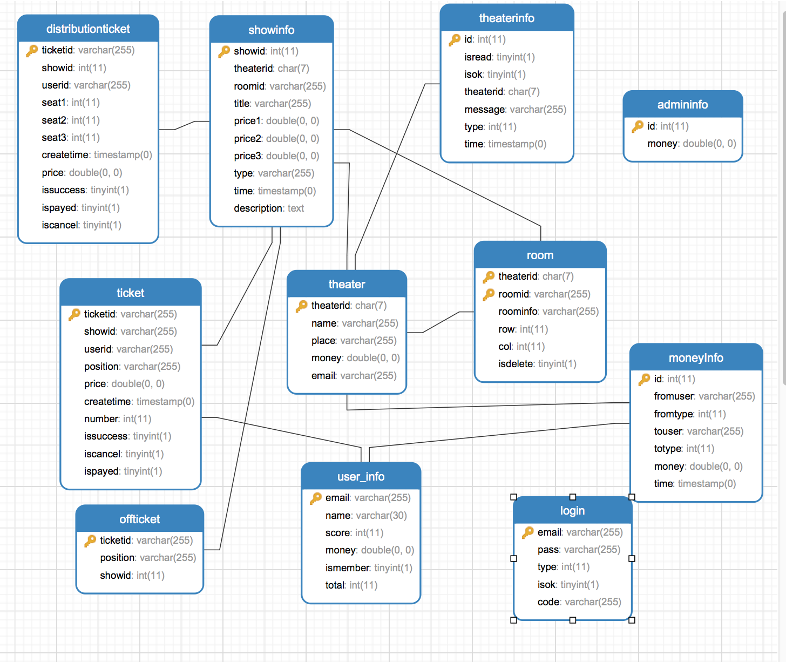
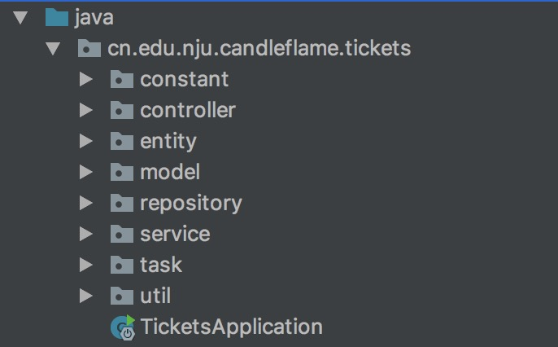
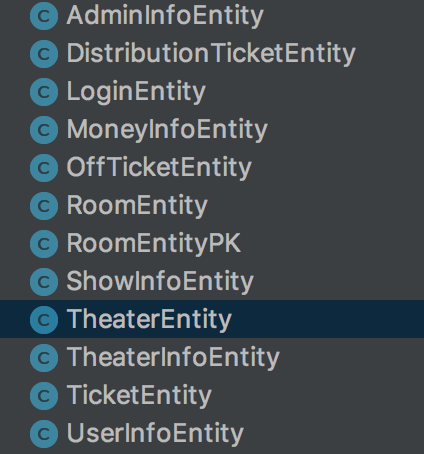
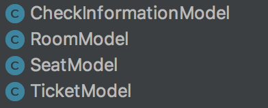
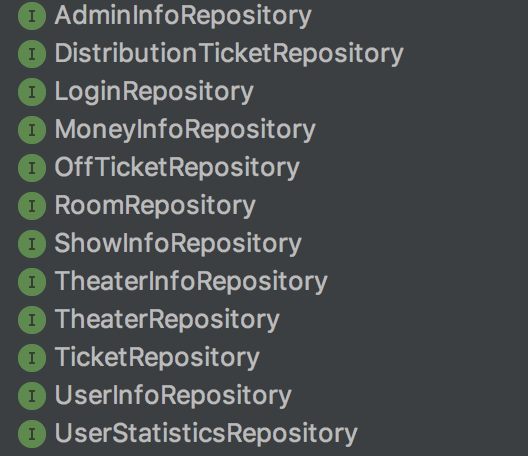
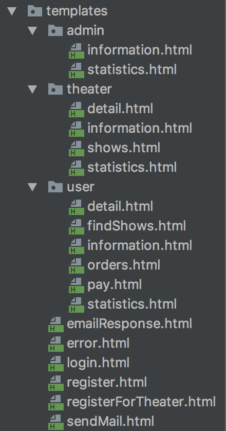

# XIaoMaiSystem
J2EE big homework

151250082 李伟民
## 数据库设计    

1. ER图

2. 数据库表（表名，各列名及数据类型，外键关系）

* admininfo

| 列名  |  数据类型 |  外键关系 |
|---|---|---|
|  id | int  |   |
|  money |  double |   |

* distributionticket

| 列名  |  数据类型 |  外键关系 |
|---|---|---|
|  ticketid |  varchar |   |
|  showid | int  |  showinfo |
|  userid |  vaechar | user_info  |
|  seat1 |  int |   |
|  seat2 |  int |   |
|  seat3 | int  |   |
|  createtime |  timestamp |   |
|  price | double  |   |
|  issuccess |  tinyint |   |
|  ispayed |  tinyint |   |
|  incancel | tinyint  |   |
* login

| 列名  |  数据类型 |  外键关系 |
|---|---|---|
| email  |  varchar |   |
|  pass | varchar  |   |
| type  |  int |   |
|  isok |  tinyint |   |
| code  |  varchar |   |
* moneyinfo

| 列名  |  数据类型 |  外键关系 |
|---|---|---|
|  id |  int |   |
| fromuser  |  varchar |   |
|  fromtype |  int |   |
|  touser | varchar  |   |
|  totype |  int |   |
| money  |  double |   |
|  time |  timestamp |   |
* offticket

| 列名  |  数据类型 |  外键关系 |
|---|---|---|
| ticketid  |  varchar |   |
|  position | varchar  |   |
|  showid |  int |  show |
* room

| 列名  |  数据类型 |  外键关系 |
|---|---|---|
|  theaterid |  char | theater  |
|  roomid |  varchar |   |
|  roominfo |  varchar |   |
|  row |  int |   |
|  col |  int |   |
|  isdelete |  tinyint |   |
* showinfo

| 列名  |  数据类型 |  外键关系 |
|---|---|---|
|  showid | int  |   |
|  theaterid |  char | theater  |
|  roomid |  varchar |  room |
|  price1 | double  |   |
|  peice2 |  double |   |
|  price3 |  double |   |
|  type |  varchar |   |
|  time |  timestamp |   |
|  description |  text |   |
* theater

| 列名  |  数据类型 |  外键关系 |
|---|---|---|
|  theaterid | char  |   |
|  name |  varchar |   |
|  place |  varchar |   |
|  money |  double |   |
|  email |  varchar |   |
* theaterinfo

| 列名  |  数据类型 |  外键关系 |
|---|---|---|
|  id |  int |   |
|  isread | tinyint  |   |
|  isok |  tinyint |   |
|  theaterid |  char |  theater |
|  message |  varchar |   |
|  type |  int |   |
|  time |  timestamp |   |
* ticket

| 列名  |  数据类型 |  外键关系 |
|---|---|---|
|  ticketid |  varchar |   |
|  showid | varchar  |  show |
|  userid |  varchar | user_info  |
|  position |  varchar |   |
|  price |  double |   |
|  createtime |  timestamp |   |
|  number |  int |   |
|  issuccess |  tinyint |   |
|  iscancel |  tinyint |   |
|  ispayed |  tinyint |   |
* user_info

| 列名  |  数据类型 |  外键关系 |
|---|---|---|
| email  | varchar  |   |
| name  |  varchar |   |
| score  |  int |   |
| money  |  double |   |
| ismember  |  tinyint |   |
|  total | int  |   |

##架构设计

1. 工程的项目结构截图；

	

2. 是否使用框架，如Spring+Hibernate 架构；

	使用了Springboot以及Springboot自带的spring-boot-data-jpa

3. 前端页面是否使用框架，如bootstrap框架；

	前端界面使用bootstrap+jquery

##类设计

1. 各包的类：名称及职责；

	* constant层
	
		| 名称  |  职责 |
		|---|---|
		|  ShowType |  记录演出形式的常量 |
		|  UserType |  用户类型的常量 |
	* controller层
	
		|  名称 | 职责  |
		|---|---|
		|  AccountController | 处理关于账户的请求  |
		|  AdminController | 管理员的用户请求  |
		|  GlobalExceptionHandler |  异常请求的展示 |
		|  OffTicketController | 处理线下订单的请求  |
		|  ShowController | 处理演出请求  |
		|  StatisticsController | 处理统计信息  |
		|  TheaterController | 处理和影院相关的请求  |
		|  TicketController | 处理和票务相关的请求  |
		|  UserController |  和用户相关的请求 |
	* entity层
	
	
	
	数据库表的相关映射
	
	* model层
	
	
	
	前端界面的数据对象
	
	* repository层
	
	
	
	data-jpa的接口定义
	
	* service层
	
	|  名称 | 职责  |
	|---|---|
	|  BankService |  处理和转账退款相关的逻辑 |
	|  MailService |  处理和邮件发送相关的逻辑 |
	|  TicketService |  处理和订票退票相关的逻辑 |
	|  UserRankService |  处理和用户会员评级的逻辑  |
	* task层
	
	|  名称 | 职责  |
	|---|---|
	|  DistributionTicketTask |  处理配票订单的定时任务 |
	|  TicketCancelTask |  处理订单取消的定时任务 |
	* util层
	
	|  名称 | 职责  |
	|---|---|
	|  GsonUtil |  字符串和Json对象的转换 |
	|  JsonUtil |  Map对象和Json对象的转换 |
	|  MD5Util |  用于字符串加密 |
	|  TimeUtil |  处理时间格式化转换  |

2. 前端的各页面：名称及功能
	
	
	| 页面  | 功能  |
	|---|---|
	| login  | 用户登录功能  |
	|  register |  用户注册 |
	|  registerForTheaster |  影院注册 |
	|  sendMail | 发送邮件提醒  |
	|  error |  错误信息提示页面 |
	| emailResponse  |  邮件确认界面 |
	|  admin/information |  管理员处理申请信息界面 |
	|  admin/statistice |  管理员统计界面 |
	|  theater/detail |  演出详细信息界面 |
	|  theater/information |  影院基本信息 |
	|  theater/shows | 影院演出计划界面  |
	|  theater/statistics | 影院统计界面  |
	|  user/detail |  用户查看演出详细信息界面 |
	|  user/findShows | 用户查看演出列表界面  |
	|  user/information |  用户查看基本信息界面 |
	|  user/orders | 用户查看订单接 main  |
	|  user/pay | 用户支付界面  |
	|  user/statistics |  用户统计界面 |
	

##其他

1. 开发环境（数据库，服务器等）；

	数据库：mysql

	服务器：tomcat8

2. 开发心得体会；

	开发感觉只是简单的信息管理系统，难度不是很大，对于订单的状态也是比较少，所以开发时间不是很长，总体来说比较简单。

3. 其他需要补充的。